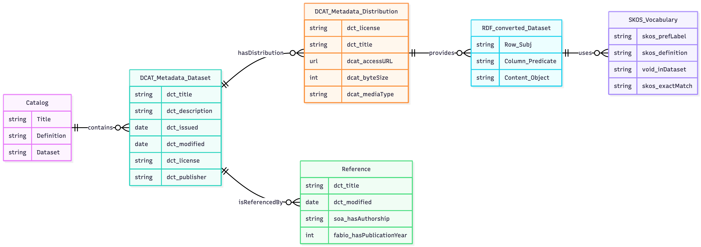
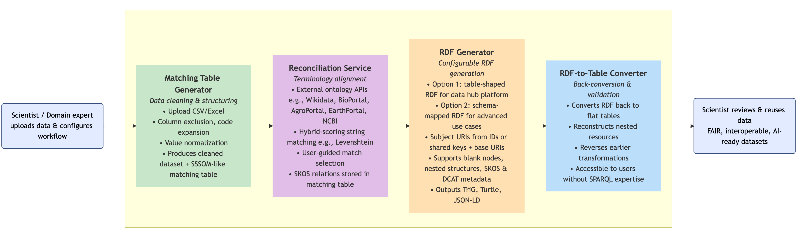

# RDF4RiskAssessment Toolkit: A Toolkit for Converting Tabular Research Data to FAIR RDF for Risk Assessment and Life Sciences

Risk assessment is crucial for consumer health protection and food safety within the Risk Analysis framework. Performing risk assessments requires the integration and analysis of data from diverse scientific disciplines, as highlighted by initiatives such as One Health. Currently, the lack of interoperable research data often results in data silos, limiting efficient knowledge exchange and the reuse of datasets by risk assessment agencies. Therefore, improving the interoperability of research data and cross-disciplinary knowledge exchange is essential to overcome these challenges. Technologies such as Knowledge Graphs and Linked Data offer solutions by applying the FAIR principles (Findability, Accessibility, Interoperability, and Reusability) and utilizing ontologies and standards to enhance data integration and reuse. However, the practical implementation of these technologies in risk assessment and regular research faces several technical and methodological challenges. To address these challenges, we developed the RDF4RiskAssessment Toolkit within the national research project "KI- & Daten-Akzelerator (KIDA).” This toolkit includes a framework designed to transform tabular research data into Linked Data, enabling better interoperability between different scientific datasets. The toolkit enhances data accessibility, fosters cross-disciplinary collaboration, and creates a foundation for advanced data-driven applications in scientific repositories and artificial intelligence-powered decision-making systems. To demonstrate the capabilities of the toolkit, we developed the KIDA Research Data Hub, which serves as a platform for hosting, accessing, and reusing Linked Data generated with the toolkit.

RDF4RiskAssessment Toolkit provides a guided workflow for preparing matching tables, reconciling terms with trusted knowledge bases, generating RDF, and converting Linked Data outputs into reviewable documentation formats. The toolset supports both semi-automatic and agent-assisted reconciliation workflows while keeping the transformation process transparent and reusable for risk assessment and life sciences datasets.

## Data Model

**Figure 1** Data model showing the four-layer architecture which is exported by the RDF4RiskAssessment Toolkit with metadata (DCAT\_Metadata\_Dataset), vocabulary (SKOS\_Vocabulary), literature (Reference), and research data (RDF\_converted\_Dataset) layers organized in named graphs.

## Workflow


**Figure2** This flowchart illustrates the modular architecture of the RDF4RiskAssessment Toolkit, designed to facilitate the transformation of scientific datasets into RDF.


# Quick Setup Guide

This guide explains how to set up a **Python environment** and run the Material UI web app with the Python backend.

---

## 1. Create a Python Virtual Environment (Recommended)

It is strongly recommended to use a virtual environment to keep your system clean and avoid package conflicts.

### a) Navigate to your project directory
In the console (e.g., Command Prompt, Terminal, or PowerShell):

```bash
# Example: Switch to the desired drive (if needed)
N:

# Change directory to your project folder
cd path\to\your\project
```

### b) Create the virtual environment

```bash
python -m venv .venv
```
This will create a `.venv` folder in your project directory.

---

## 2. Activate the Virtual Environment

- **Windows:**

```bash
.venv\Scripts\activate
```

- **macOS/Linux:**

```bash
source .venv/bin/activate
```

If activated successfully, you will see the environment name (`(.venv)`) appear in front of your console prompt.

---

## 3. Install Dependencies

Make sure you are inside the activated environment. Then install all required libraries:

```bash
pip install -r requirements.txt
```

---

## 4. Run the Material UI App

After activating the environment and installing the dependencies:

1. Install frontend dependencies once:

```bash
npm --prefix frontend install
```

2. Start the Python backend and Material UI frontend together:

```bash
npm run start
```

The frontend is served by Vite and talks to `mui_backend_server.py` on `http://127.0.0.1:8765` by default.

---

# Notes
- Always activate your virtual environment before running or installing anything.
- To deactivate the environment after work, just type:

```bash
deactivate
```

---

# Quick Commands Summary

```bash
# Navigate to your project directory
N:
cd path\to\your\project

# Create and activate virtual environment
python -m venv .venv
.venv\Scripts\activate   # (Windows)
source .venv/bin/activate # (macOS/Linux)

# Install all required packages
pip install -r requirements.txt

# Run the Material UI app with the Python backend
npm run start
```

Developers: 
Michael Zarske, 
Taras Günther, 
Iurii Savvateev